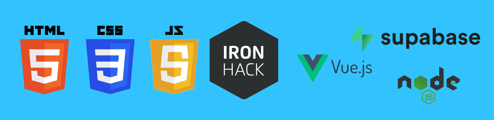

<h1 align="center">
  <a href="https://github.com/dzc1/amazon-class01-apr23">
    
  </a>
</h1>
<p align="center">Este repositorio sirve como una guia para vuestra clase.</p>
<p align="center">Donde estaremos apendiendo acerca de HTML, CSS3, Javascript, Vue & Supabase.</p>
<p align="center" style="font: 16px">Creado con ❤️ por Diego Zito.</p>
<p align="center" style="font: 16px">Integridad, Responsabilidad, Apoyo Mutuo</p>

## Link a Zoom

[Link Video Zoom](https://ironhack.zoom.us/j/98932082308)

## Estructura de Carpetas

<details>
   <summary>Table of Contents</summary>
   <ul>
      <li>
       <a href="">HTML Basics</a>
      </li>
      <li>
       <a href="">CSS Basics</a>
      </li>
      <li>
       <a href="">Javascript Basics</a>
      </li>
   </ul>
</details>

## Links de Ayuda

- [VS Code - Video Tutoriales](#vscode-video-tutorials)

  - [VS Code Install - Windows](https://www.youtube.com/watch?v=X_Z7d04x9-E)
  - [VS Code Install - mac](https://www.youtube.com/watch?v=5vcQAfvDsz0)
  - [Como abilitar extension 'Live Server' dentro de VS Code](https://www.geeksforgeeks.org/how-to-enable-live-server-on-visual-studio-code/)

- [Video Tutorials](#video-tutorials)
  - [Command Line Crash Course](https://youtu.be/uwAqEzhyjtw)
  - [HTML Crash Course - English](https://youtu.be/UB1O30fR-EE)
  - [HTML Crash Course - Spanish](https://www.youtube.com/watch?v=rbuYtrNUxg4)
  - [CSS Crash Course - English](https://youtu.be/yfoY53QXEnI)
  - [CSS Crash Course - Spanish](https://www.youtube.com/watch?v=wZniZEbPAzk)
  - [Git & Github Tutorial - English](https://www.youtube.com/watch?v=HkdAHXoRtos)
  - [Git & Github Tutorial - Spanish](https://www.youtube.com/watch?v=vlCXdvcgiE0)

<hr />

## Git

Git es una herramienta de control de versiones que nos ayuda a guardar y seguir los cambios que hacemos en un proyecto de computadora.

### ¿Para qué sirve?

Git es muy útil cuando trabajamos en proyectos grandes con otros programadores, porque nos permite guardar y compartir fácilmente el código que estamos escribiendo y asegurarnos de que todo el mundo tenga la última versión del proyecto.

### ¿Cómo lo usamos?

Usamos Git a través de la línea de comando de la computadora, y podemos hacer cosas como crear un nuevo proyecto, guardar cambios, y ver el historial de cambios que hemos hecho en el proyecto.

### Ejemplo

Digamos que estamos trabajando en una página web sencilla y queremos hacer algunos cambios en el diseño. Usamos Git para guardar los cambios que hacemos en los archivos de la página web y luego los subimos a GitHub para que otros programadores puedan ver los cambios y agregar sus propias mejoras.

Por ejemplo, si queremos cambiar el color de fondo de la página a azul, usamos Git para guardar ese cambio en los archivos de la página web. Luego, subimos los archivos a GitHub para que otros programadores puedan ver el cambio y agregar su propio código para hacer que la página se vea aún mejor. ¡Es como si estuviéramos pintando un dibujo juntos y cada uno agrega su propio toque para que el dibujo sea más hermoso!

<hr />

## Github

GitHub es un sitio web que nos permite guardar y compartir proyectos de computadora con otros programadores.

### ¿Para qué sirve?

GitHub es muy útil cuando trabajamos en proyectos grandes con otros programadores, porque nos permite compartir fácilmente el código que estamos escribiendo y colaborar en el proyecto. También podemos usar GitHub para controlar las versiones de nuestro proyecto y asegurarnos de que todo el equipo tenga la última versión del proyecto.

### ¿Cómo lo usamos?

Podemos usar GitHub para subir nuestros proyectos de computadora, agregar otros programadores al proyecto, trabajar en diferentes versiones del proyecto, y colaborar con otros programadores en el proyecto.

### Ejemplo

Por ejemplo, si estamos trabajando en un proyecto para crear una aplicación de juego, podemos usar GitHub para guardar el código que estamos escribiendo, agregar otros programadores al proyecto para que puedan ayudarnos a escribir el código, y trabajar en diferentes versiones de la aplicación de juego para asegurarnos de que todo esté funcionando correctamente. ¡Es como si estuviéramos jugando un juego en equipo y trabajando juntos para ganar!

## Comandos de Git

Sigue estos pasos para hacer cambios en tu repositorio:

Para subir tus cambios al stream de git tienes que `añadir` tus cambios recientes mediante el siguiente comando:

`Añadir` todos tus cambios:

```bash
git add .
```

`Añadir` cambio individual por nombre de archivo:

```bash
git add "nombre de archivo ej: 01-bsaic-layout.html"
```

`Añadirle` un `comentario` al `commit` que estaremos empujando a tu repositorio en la web.

```bash
git commit -m "Texto descriptivo de los cambios recientes"
```

`Empujar` los cambios recientes a tu repositorio en la web. `Extended`.

```bash
git push origin "nombre del branch/rama que estaremos apuntando"
```

`Empujar` los cambios recientes a tu repositorio en la web. `Simplified`.

```bash
git push
```

### Combinations - Git

#### Combination #1 - Extended

Hace una combinacion de `git add commit push` usando estos comandos de `git` y usando un un operador logico `AND` con el syntax `&&`

```bash
git add . &&
git commit -m "Texto descriptivo de los cambios recientes" &&
git push origin "nombre del branch/rama que estaremos apuntando"
```

#### Combination #2 - Simplified

Hace una combinacion de `git add commit push` usando estos comandos de `git` y usando un un operador logico `AND` con el syntax `&&`

```bash
git add . &&
git commit -m "Texto descriptivo de los cambios recientes" &&
git push
```

Ver los `branches` asociados al repositorio.

```bash
git branch
```

Hacer un `pull` de los ultimos cambios de un repositorio git en gitHub a tu repo local

```bash
git pull origin "nombre del branch/rama que estaremos apuntando"
```

## Shortcuts (Atajos de teclado)

Los atajos de teclado hacen que seas más productivo y feliz. En general son como ese buen amigo del que te puedes fiar no para que haga su trabajo, pero sí para que te lo haga menos pesado.

Aprende a usarlos, pero tampoco pierdas la cabeza. Con que te centres en los más comunes ya ganarás mucho.

- Guardar archivo en VS Code. Windows: Control + S. MAC: Command + S
- Plegar y desplegar la consola. Windows: Control + Ñ. MAC: Shift + command + C
- Plegar y desplegar la jerarquía. Windows: Control + B. MAC: Command + B
- Colocar una ventana en la mitad derecha/izquierda de la pantalla. Windows: windows + derecha/izquierda. MAC: [Spectacle](https://www.spectacleapp.com/)
- Navegar entre ventanas. Windows: alt o windows + tabulador. MAC: Command + tabulador.
- Navegar por un texto.
  - Windows:
    - Control + flecha de dirección -> Salta hasta el próximo caracter especial
    - Shift + flecha de dirección -> Selecciona los caracteres sobre los que pases con el cursor.
  - MAC:
    - Command + flecha de dirección -> Salta hasta el próximo caracter especial
    - Shift + flecha de dirección -> Selecciona los caracteres sobre los que pases con el cursor.

El resto de atajos te recomendamos que solo los aprendas cuando veas que los necesitas. Échale un vistazo por encima a las listas para que por lo menos te suenen y sepas que existen, pero no gastes tiempo en aprender algo que jamás usarás.

Si quieres saber más, visita los siguientes enlaces.

[Windows shortcuts](https://support.microsoft.com/es-es/windows/m%C3%A9todos-abreviados-de-teclado-de-windows-dcc61a57-8ff0-cffe-9796-cb9706c75eec)
[Windows VS Code shortcuts](https://carontestudio.com/blog/atajos-de-teclado-en-visual-studio-code/)

[MAC shortcuts](https://support.apple.com/es-es/HT201236)
[MAC VS Code shortcuts](https://manolohidalgo.com/atajos-de-teclado-en-visual-studio-code-para-mac/)
